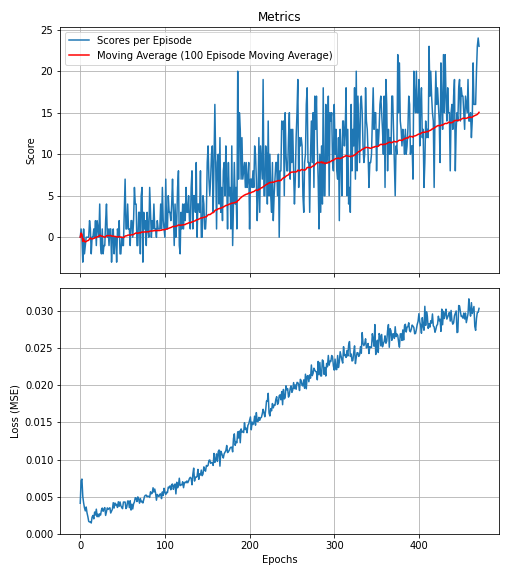

# <u>Navigation Report</u>

#### <u>Learning Algorithm</u>
The learning algorithm consists of:
- Neural network
- Deep Q-Network
- Replay memory

The learning algorithm was compiled from the library [Pytorch](https://pytorch.org/). The network consists of an input layer (taken from the state space), hidden layers (or a hidden layer, depending on the user preference), and a final output layer, which consists of an array the size of the action space containing the prediction probabilities of the best action given the state space. 

#### <u>Deep Q-Network</u>
A Deep Q-Network has been initiated for this project. This consists of 2 Q-Networks (local and target network), where the target network updates every couple of steps to avoid oscillations in the learning procedure.

#### <u>Parameters</u>
To find the best fitting parameters that return the most consistent results, a hyperparameter tuning function was coded into the Deep Q-Network network to iterate over all possible unique combinations set by the user. Since the number of combinations can become overwhelming to train, first a few basic parameters were tested before expanding the search parameters. The final parameters chosen were:

- The greedy epsilon was started at 1.0 with a decay factor of 0.995 until it reaches 0.01. The random choice factor for the actions to take has the highest probability of selecting forward, then left and right, with backwards having the lowest probability of being chosen.

- Experience replay memory size chosen was 200,000 with a batch size of 200 and an update frequency every 5 steps.
- The neural network consists of 2 hidden layers, each with 148 perceptrons. These hidden layers were also given a per cent dropout factor of 25% to prevent overfitting.
- Tau (soft-update interpolation parameter for the target network): 0.001
- Gamma (discount factor): 0.995
- Learning rate: 0.0005

#### <u>Final Training</u>

The Deep Q-Network consistently solved the environment within 400 episodes successfully, with a target reward of 15.

#### <u>Testing the Trained Network</u>
After running 100 iterations of the trained network, an average score of 15.91 was achieved.

#### <u>Watch a Trained Network</u>

#### <u>Improvements</u>

To make improvements we could build a convolutional neural network to analyse the pixels of the environment at each state. 

Other methods could be considered, such as:
- Double Deep Q-Network
- Dueling Deep Q-Network
- Prioritized experience replay

